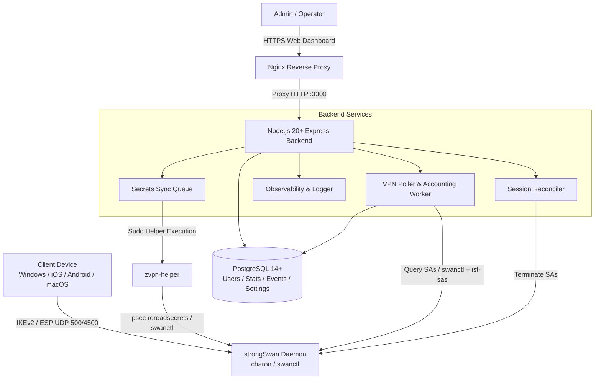

# ZVPN Architecture & Multi-Agent Design

## Overview
ZVPN Panel is an enterprise-grade IKEv2 / IPsec VPN management panel designed to manage strongSwan services with high reliability, robust multi-device session reconciliation, automated traffic accounting, and security hardening.

---

## 1. Multi-Agent Domain Responsibilities

### Agent 1: VPN & strongSwan Specialist
- **Session Reconciliation**: Resolves duplicate sessions without race conditions. strongSwan reports SA age (`established`) in seconds.
- **Oldest vs. Newest Sorting**:
  - `disconnect_oldest`: Keeps the newest active sessions and evicts oldest ones once the user exceeds `max_devices` for `graceMs` (default 45s).
  - `reject_newest`: Keeps earlier sessions and terminates incoming excess sessions.
- **Proposals**:
  - `ike=aes128-sha256-ecp256,aes128-sha256-modp2048,aes256-sha256-modp2048,aes128-sha1-modp1024,aes256-sha1-modp1024`
  - `esp=aes128-sha256,aes256-sha256,aes128-sha1,aes256-sha1`

### Agent 2: Backend Architecture
- **Layered Architecture**: Decoupled Controllers, Services, Repositories, Middlewares, and Background Workers.
- **Transactions & Concurrency**: PostgreSQL row-level locks (`SELECT FOR UPDATE`) on SA snapshots to prevent delta traffic loss during concurrent polling cycles.

### Agent 3: Security Engineering
- **Helper Isolation**: The panel runs as unprivileged user `zvpn` and interacts with root system services strictly through `/usr/local/sbin/zvpn-helper` via sudoers rules.
- **Symmetric Encryption**: User secrets are encrypted with `AES-256-GCM` using random IVs and authenticated tags derived from `MASTER_KEY`.
- **RBAC**: Three-tiered role authorization: `superadmin` > `admin` > `operator` > `viewer`.

### Agent 4: Observability & Logging
- **Structured JSON Logs**: Outputs standard JSON logs with levels `error`, `warn`, `info`, and `debug`.
- **Sensitive Key Redaction**: Recursively strips passwords, tokens, master keys, and authorization cookies.
- **Audit Persistence**: All mutating operations, connection events, and system errors are written to the `system_events` table.

### Agent 5: Frontend Experience
- **React + Vite + TailwindCSS**: Modern SaaS user interface supporting Light and Dark modes.
- **Real-Time Dashboards**: Visual resource gauges, online session counters, and interactive Recharts data visualizations.
